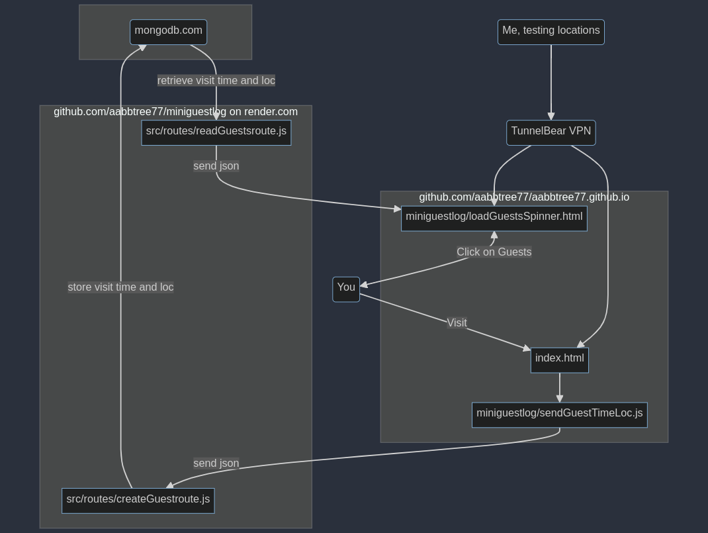

> [“Enshittification, also known as platform decay,[1] is the pattern of decreasing quality of online platforms that act as two-sided markets.”](https://en.wikipedia.org/wiki/Enshittification) 

<table align="center">
    <tr>
    <th align="center"> A Simple MERN App to Track Visitors</th>
    </tr>
    <tr>
    <td>
    
    </td>
    </tr>
</table>

## Introduction

This MERN app shows me the people who visit my github page aabbtree77.github.io. For that, I only need to click on the link "Guests" on that same page. There is no "R" in this application, only plain Js. This code is hosted on render.com (with a free plan) and uses a free mongodb.com account to store data. The frontend code is at https://github.com/aabbtree77/aabbtree77.github.io. 

There is nothing safeguarded here as it is hard with raw MERN, but I do not store any sensible information anyway. Only a visitor's time and city is logged. There is a danger that an attacker could overflood one server endpoint, but I share all this code just in case someone would want to build a similar minimal guest book/log.

Tracking can be accomplished with [Google Analytics](https://en.wikipedia.org/wiki/Google_Analytics) (GA) much quicker and much more reliably. However, GA stores sensitive data and is banned in many European countries such as France, Finland, Sweden... It is not banned in Lithuania, though. The GA interface is bureaucratic and takes time digging, while with this code I can monitor only what I need, wherever I need.

TunnelBear VPN helps to vary the client IP/location and see if the code reports correct country codes. I use ipify.org with the geoip-lite npm library to detect and convert the IP to the city and country names. It is unclear if the geoip-lite database will be updated on render.com, and how often. One could find some free 3rd party services that detect and convert the IP to location more directly than I did with the double fetch. 

All the tools that I have listed in this section are totally free, for now (December 17th, 2023).

## MERN

MERN feels a bit low level in this day and age, but there are a lot of tutorials and hosting is easy thanks to render.com. [Next.js with Supabase](https://www.youtube.com/watch?v=zut46AB8DHQ&t=227s) might be more productive. The client side Js gave me one small headache with a double fetch which had to be nested. I did not bother much with Fetch vs Axios, Js vs Ts, also used ChatGPT whenever needed. In any case, fixing Js problems with console.log() is easier than working with OpenGL and C++, or reading Weinberg's QFT. However, I am not sure if the error handling in that nested fetch case is any good, I was only content to make the code work when things run as they should. Asynchrony is one big source of undefined in Js.

During the development, I learned from reddit that Postman API could be in the process of **enshittification**, and rushed to use VS Code with an extension called [REST Client](https://marketplace.visualstudio.com/items?itemName=humao.rest-client). The latter is simple and snappy, which I cannot say about VS Code.

In any case, I have greatly benefited from these works:

[Web Dev Cody: TODO with Authentication](https://www.youtube.com/watch?v=oJBu2k7OEk8). The React part is rushed and convoluted, and I am not sure about authentication, but I started my web journey with this code.

Net Ninja: [TODO-I](https://www.youtube.com/watch?v=98BzS5Oz5E4&t=2s), [TODO-II](https://www.youtube.com/watch?v=WsRBmwNkv3Q&t=1s). The same thing, but better styled and more expanded. I am not sure I would want to follow and rely on the authentication part. 

[EdRoh: MERN Dashboard](https://youtu.be/0cPCMIuDk2I?t=24251). Useful to follow the deployment on render.com. Unlike some other tutorials, it does not miss an important step that demands whitelisting render.com IP addresses on mongodb.com.
 
