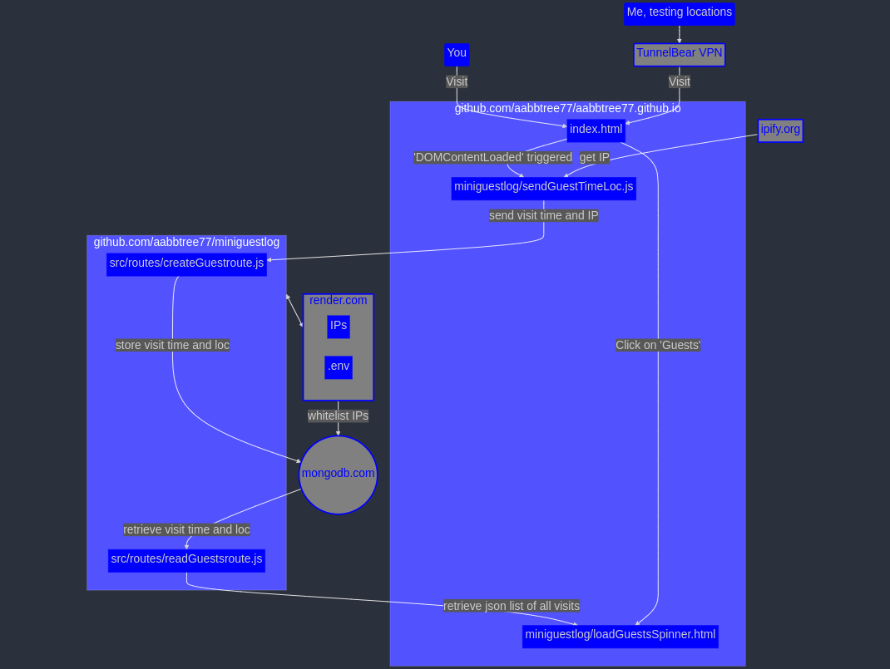

> [“Enshittification, also known as platform decay,[1] is the pattern of decreasing quality of online platforms that act as two-sided markets.”](https://en.wikipedia.org/wiki/Enshittification)<br>

<table align="center">
    <tr>
    <th align="center"> What It Takes To Store Visitor Location</th>
    </tr>
    <tr>
    <td>
    
    </td>
    </tr>
</table>

## Introduction

This MERN web app monitors my homepage [aabbtree77.github.io](https://aabbtree77.github.io/). The visitor time, city, and country are displayed by clicking on the link `Guests` inside the `CV` tab on the landing page. 

The problem looks trivial, but the solution uses the following web services:

- github pages to host frontend at [aabbtree77/aabbtree77.github.io](https://github.com/aabbtree77/aabbtree77.github.io).

- github to develop backend (this repo at [aabbtree77/miniguestlog](https://github.com/aabbtree77/miniguestlog)).

- render.com (free plan) to CI/CD/host this code.

- mongodb.com Atlas (free plan) to store data.

- MongoDB Compass dekstop app to clean the list occasionally.

- ipify.org to get the visitor IP.  

- maxmind.com GeoLite2 DB to infer the city and country based on the IP.

- BearVPN to test different geolocations.

Tracking can be accomplished much much easier with [Google Analytics](https://en.wikipedia.org/wiki/Google_Analytics) (GA) for free, without coding. However, GA is bloated and banned in many European countries such as France, Finland, Sweden...

## MERN

MERN (Mongo, Express, React, Node) is ideal here, but it will lack authentication and structure for anything bigger. The client side Js gave me one small headache with an async double fetch which had to be nested. No React is applied in this code. 

I did not bother much with Fetch vs Axios, TanStack Query, Js vs Ts, also used ChatGPT whenever needed. Fixing Js and CSS problems with console.log() and Chrome F12 tools is a joy compared to working with OpenGL.

During the development, I learned from Reddit that Postman API could be in the process of **[enshittification](https://www.reddit.com/r/webdev/comments/16tq1eh/now_that_postman_sucks_is_there_a_good_alternative/)**, and rushed to use VS Code with an extension called [REST Client](https://marketplace.visualstudio.com/items?itemName=humao.rest-client). The latter is simple and snappy.

## render.com Is Wonderful, the Free Plan Is Not

The app is deployed on render.com, which is amazing in that it allows to `git push origin main` and see the changes instantly 
deployed as a complete web app without **all that deployment quagmire**. The GUI is intuitive, and everything works 
reliably.

However, the fees are Vercel-alike, and one needs to watch out for the use limits, DDoS!

The free plan on render.com is rather horrid:

- It shuts down the nodes after 15 minutes of any request inactivity: [1](https://community.render.com/t/cold-boot-start-of-the-server-for-first-request/15911), [2](https://docs.render.com/docs/free). Later on, the first request will take the whole minute or two to process, the things run smoothly again, until the next inactivity.

- It disables shell, so any quick testing can only be done via app's index.js reuploaded. `postinstall` bash script in `package.json` runs fine.

- 1 GB of SSD storage for PostgreSQL databases, which expire after 30 days, this is why I also must use MongoDB Atlas.

- It is not entirely clear how well it handles complex fast moving projects like Bun.js, Next.js. 

[Web Dev Cody](https://youtu.be/ixCEmwH1D8c?t=821) prefers Vercel for his Next.js deployments.

I appreciate the service of render.com, but the free plan is only good for testing with external DBs 
and personal web apps, such as this one.

## MongoDB Atlas

One can access MongoDB Atlas in two ways: (i) Chrome, and (ii) MongoDB Compass on Ubuntu 22.04.   

The Chrome GUI occasionally is disfunctional with 

```
"Request invalid. Please visit your Clusters and try again."
```

after clicking on Database -> Cluster0 -> Collections, despite the IP being whitelisted. Googling does not help much, but the error does not happen often.

MongoDB Compass solves this problem, but it is an extra desktop app with its own GUI and shell. It works well though.

Deleting multiple entries (documents) is not possible in the online GUI. In MongoDB Compass, one needs to get into MONGOSH shell, and then execute the commands such as

```
> db.guests.deleteMany({city:"Kaunas"})

> {
   acknowledged: true,
   deletedCount: 19
  }
```

The shell does not support the right mouse click, mouse selection is limited to a single line, ctrl+c works fine. 

One has to be extra-careful with connection URIs. Database -> Connect gives a generic URI, but one needs to append it with a specific database (collection) name set up during the creation, which may not be visible due to the retrieval error indicated above. Typing this in MongoDB Compass (with a proper username and password)

```
mongodb+srv://<username>:<password>@cluster0.0vbktln.mongodb.net/
```

does not display any errors, it connects and displays the collections, but MONGOSH would not work. 

I had to explicitly reconnect with the collection name "guests" appended

```
mongodb+srv://<username>:<password>@cluster0.0vbktln.mongodb.net/guests
```

for MONGOSH to work. 

Note the collection names, look into .env files set up on render.com.

The MongoDB's free tier is only 500MB, but it seems to be free forever, not for 30 days.

## Security

I have limited my MongoDB collection to 10MB and 200 documents (the free MongoDB Atlas plan provides a lot more, 512MB storage). 

This is a capped collection, the newest document overwrites the oldest one, so an attacker can only flood the server API, but it won't crash the server. 

The frontend is set to retrieve only 50 latest items, all at once, so it should not hang the browser. 

Typically, it will be less than 250KB of data to download. The log is visible to everyone as there is no sensitive data.

## Geolocation

At first, I have used the NPM package

```js
const geoip = require("geoip-lite");
```

It worked for several years reliably. Note the following though:

- geoip-lite uses MaxMind’s free GeoLite2 database without requiring any registrations, keys, it is hassle-free.

- It bundles the free database at publish-time, which eventually sadly gets outdated and needs manual version updates and redeployment.

- [The code](https://www.npmjs.com/package/geoip-lite?activeTab=dependencies) is not actively maintained anymore.

Therefore, the switch was made to use MaxMind's free GeoLite2 database properly with registration and

```js
const { Reader } = require('@maxmind/geoip2-node');
```

geoip2-node takes some effort to setup. One needs to:

- register at maxmind.com, login there, generate the key, 

- put it inside `.env` with the latter in .gitignore on github,

- set the key also as an environment variable on render.com, 

- set up the postinstall script in package.json to download and untar a free version of 
DB (into 64MB). 

Make sure to set `.gitignore` not to commit any DB files on github as it imposes 
the limit of 100MB and GeoLite2 may exceed that. Removing a large file from an erroneous commit (exceeding limits) is doable, 
but also a hassle. Downloading the file automatically as in this code to render.com is perfectly fine.

Make sure to inform chatgpt about the latest changes of [MaxMind API.](https://dev.maxmind.com/) The paths and code API.

Once the setup works, it is amazing what even the free constantly updated version of the DB does. 
The code no longer confuses Vilnius with Kaunas, the two Lithuanian cities 100km apart. 

The GeoLite2 DB gets automatically 
updated/downloaded every time the code is git pushed to render.com, via

```js
"postinstall": "bash scripts/fetchdb.sh"
```

It is possible to use MaxMind via http fetch directly, but this saves some network traffic. A premature optimization likely.

## Mermaid

Mermaid diagrams look good for simple diagrams, but I would no longer use them for anything. See the figure above, the automated node placement is very suboptimal, styling tedious and buggy/nontrivial. 

Next time I will use Excalidraw or draw.io (app.diagrams.net).

## A Year Later: 2004

This small web app runs for over a year continuously (since January 2024). It takes one click to redeploy the newest github commit on render.com, but the free plan with cold starts is somewhat annoying. It solves the problem though, I can log my visitors. After all, 
this is for me to see a visitor, not for the masses, I can wait.

MERN (Express) is simpler than metaframeworks, but they all lack built-in authentication and inexpensive hassle-free hosting. [MongoDB](https://www.mongodb.com/pricing) starts at 8 cents/hour for 10GB, while render.com is at least 20$/month just like Vercel, and the caps or their lack is always scary for an indie developer. 

~~I plan to go with [Better Auth](https://www.better-auth.com/) and SQLite, all self-hosted on Hetzner, but it is not clear how to achieve the productivity and ease of managed clouds. [Turso](https://turso.tech/pricing) looks generous enough at the moment. PocketBase is also worth trying to avoid coding everything from scratch, with some chance to keep everything under control.~~

## Two Years Later: 2025

November 18, 2025, the app got broken. Chrome shows that a fetch from render.com does not work, the log on render.com indicates 
two errors: 

- Newer TLS version is now required by MongoDB Atlas, but it is not supported by the Mongoose ORM deployed on render.com a year or two ago. Here I had to play with the Mongoose connection options in index.js, and nothing worked there. The solution turned out to be not to specify anything TLS related. Remove package-lock.json, rm -rf node_modules, npm install, git push origin main, `clean cache and redeploy manually` on render.com (one button click).

- render.com has managed to add two new IP addresses along with the old ones, which broke the connectivity to Atlas! The solution was to whitelist those new IPs from render.com on MongoDB Atlas.

## Conclusion

One can see why the web is so problematic. Even for a simple problem of maintaining a small list of visitor locations there are so many moving pieces. MaxMind have changed their API once which is visible from chatgpt hallucination, they might do it again. render.com added new IPs which broke MongoDB Atlas. Some regular gymnastics with broken Node driver from MongoDB Atlas due updated TLS version, a very mild problem with invisible caching on render.com already when using Express, imagine what is to come with caching using Next.js...

Would I recommend this stack, use it commercially? DDoS is scary, see the case of [Web Dev Cody](https://www.youtube.com/watch?v=-lNpF0ACe1Y). IMHO, PaaS is only suitable when being VC-funded and into rapid movement/massive delegation, at the cost of not being afraid to take an occasional spectacular DDoS bill. PaaS is also great for testing, demos, and the possibility of free plans. Notice that I am running all this for free, a VPS would demand more work and a monthly bill.

For anything serious I would go with the VPS though. It is a lot of hassle, but ChatGPT is doing extremely well on common scripting.

## References

I have greatly benefited from these works:

[Web Dev Cody: TODO with Authentication.](https://www.youtube.com/watch?v=oJBu2k7OEk8) The React part feels convoluted, and I am not sure about authentication, but my web journey has begun with this code.

[Web Dev Cody: Save Your Time - I deployed Next.js to different services (so you don't have to).](https://youtu.be/ixCEmwH1D8c?t=821)
render.com is completely fine here. Web Dev Cody has a lot of good videos about whether to deploy on VPS manually, use Docker/Swarm, and K8, go with AWS, or complete 3rd party services such as Vercel. I have not decided yet on my default deployment technology. These tools are changing perpetually and deployment is a complete nightmare. At the moment (November 2025), Hetzner with Dokploy is gaining traction, but something tells me this is not it. I would go manually with raw VPS + ChatGPT, be it Hetzner or something else.

[Web Dev Cody: I got my first DDoS (and what you can do to help prevent it).](https://www.youtube.com/watch?v=-lNpF0ACe1Y) Hint: Go with a raw VPS, at least no huge bills and you control everything when the shit hits the fan. Also, it is the only way to make anything at least mildly reliable and not demanding constant updates.

Net Ninja: [TODO-I](https://www.youtube.com/watch?v=98BzS5Oz5E4&t=2s), [TODO-II.](https://www.youtube.com/watch?v=WsRBmwNkv3Q&t=1s) MERN with manual bare-bones auth. I like it, but it is probably no longer relevant. Most of the frontend jobs (LT, 2025) demand Ts, React, and Next.js which should actually be called Next.ts.

[EdRoh: MERN Dashboard.](https://youtu.be/0cPCMIuDk2I?t=24251) Shows the deployment on render.com. Unlike some other tutorials, it does not miss an important step that demands whitelisting render.com IP addresses on mongodb.com.

[Rajkumar Gaur: Beautiful Spinner in CSS.](https://medium.com/nerd-for-tech/beautiful-spinner-in-css-bce7a348f50f). It allows to avoid loading images. It had one bug visible when the spinner size was large. See my frontend CSS code around "@keyframes rotate" inside spinner.css at [https://github.com/aabbtree77/aabbtree77.github.io/miniguestlog](https://github.com/aabbtree77/aabbtree77.github.io/miniguestlog). 

Frontend bugs can be located with Chrome's F12 at runtime. Add a break point, click on "Elements", and then enable/disable various CSS properties while observing the result. Imagine we had such debuggability with 3D backends and Make files... I would take dynamic typing over the static any day.

[Josephine Loo: How to Overlay Text on an Image in HTML and CSS.](https://www.bannerbear.com/blog/how-to-overlay-text-on-an-image-in-html-and-css/) If applied directly, it would rotate the message with the spinner. Instead, make a separate div centered at the spinner, and then set a large z-index value of the message div.

[Capped Collections.](https://www.mongodb.com/docs/manual/core/capped-collections/)

[MongoServerError: user is not allowed to do action [collMod].](https://stackoverflow.com/questions/77071661/user-is-not-allowed-to-do-action-collmod-on-db-name-collection-name)

[Retrieve last mongodb entry in nodejs.](https://stackoverflow.com/questions/40769907/retrieve-last-mongodb-entry-in-nodejs)
 
