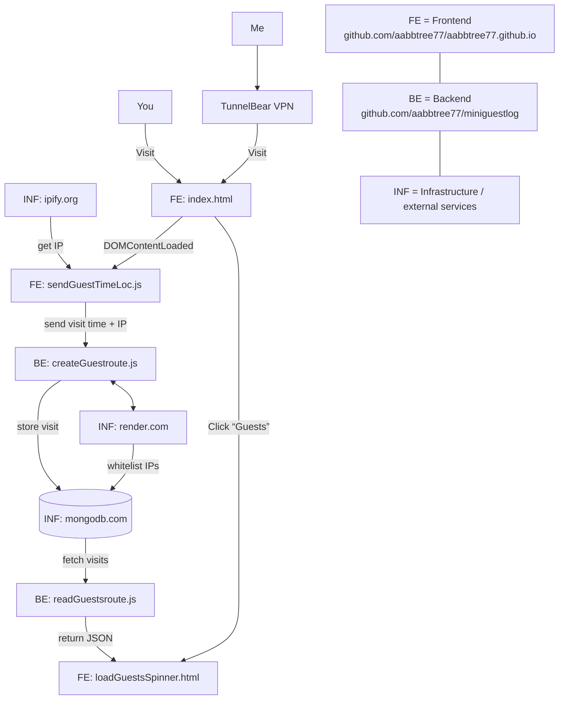

> "And these are the days <br>When our work has come asunder"
>
> \- U2 Lemon, 1993
> <br>

<p align="center">
  <b>What it takes to store visitor location</b>
</p>



## Introduction

This MERN app monitors my homepage [aabbtree77.github.io](https://aabbtree77.github.io/). Visitors' time, city, and country are displayed by clicking on the link `Guests` inside the `CV` tab there.

The simplest solution I have come up with:

- Github Pages to host frontend at [aabbtree77/aabbtree77.github.io](https://github.com/aabbtree77/aabbtree77.github.io).

- github.com to develop backend (this repo at [aabbtree77/miniguestlog](https://github.com/aabbtree77/miniguestlog)).

- render.com (free plan) to CI/CD/host backend.

- mongodb.com Atlas (free plan) to store visitor's time, city, country.

- MongoDB Compass dekstop app to clean DB occasionally.

- ipify.org to get visitor's IP.

- maxmind.com GeoLite2 free DB to infer the city and country based on the IP.

- BearVPN (free plan) to test different geolocations.

Tracking can be accomplished much much easier with [Google Analytics](https://en.wikipedia.org/wiki/Google_Analytics) (GA) for free, without coding. However, GA is not dev-friendly and is banned in many European countries such as France, Finland, Sweden...

## MERN

MERN (MongoDB, Express, React, Node) is the best choice for minimal apps, with the following to note:

- Js has one advantage over Ts: One can directly inspect Js on the browser.
  Something breaks after a year or two, a quick fix is often possible without redoing the whole VS Code setup.

- There are three different module systems (require vs import vs script), and three different ways to do async (ES5, ES6, ES8).

- mongodb.com is great due to the Atlas service (with a free plan), but everything around is SQL, see [DB ranking](https://db-engines.com/en/ranking).

- Authentication is a mess, nobody has good answers. Thankfully I did not need it here.

- Watch out for a nested async double fetch on the client side.

I did not bother whether to apply Fetch or Axios, ES6 or ES8 (they are mixed badly), TanStack Query, used ChatGPT whenever needed, coded in VS Code with [REST Client](https://marketplace.visualstudio.com/items?itemName=humao.rest-client) rather than Postman API which could be in the process of **[enshittification.](https://www.reddit.com/r/webdev/comments/16tq1eh/now_that_postman_sucks_is_there_a_good_alternative/)**

## render.com

The app is deployed on render.com. The service allows to `git push origin main` to this repo and see the changes instantly
deployed as a complete web app without quagmire. The render.com GUI is intuitive, everything works reliably. Sometimes one must
clear cache manually in the GUI as it picks up an older version of this repo.

The fees are Vercel-like, and one needs to watch out for the use limits, DDoS!

The free plan on render.com is somewhat horrid:

- It shuts down the nodes after 15 minutes of any request inactivity: [1](https://community.render.com/t/cold-boot-start-of-the-server-for-first-request/15911), [2](https://docs.render.com/docs/free). Later on, the first request will take the whole minute or two to process, the things run smoothly again, until the next inactivity.

- It disables shell, so any quick testing can only be done via app's index.js reuploaded. `postinstall` bash script in `package.json` runs fine.

- 1 GB of SSD storage for PostgreSQL databases, which expire after 30 days, this is why I also must use MongoDB Atlas.

It is not entirely clear how well render.com handles complex fast moving projects like Bun.js, Next.js. [Web Dev Cody](https://youtu.be/ixCEmwH1D8c?t=821) prefers Vercel for his Next.js deployments.

The free plan is only good for testing external DBs and personal web apps, such as this one.

## MongoDB Atlas

One can access MongoDB Atlas in two ways: (i) Chrome, and (ii) MongoDB Compass on Ubuntu 22.04.

The Chrome GUI occasionally is disfunctional with

```
"Request invalid. Please visit your Clusters and try again."
```

after clicking on Database -> Cluster0 -> Collections, despite the IP being whitelisted. Googling does not help much, but the error does not happen often.

MongoDB Compass solves this problem, but it is an extra desktop app with its own GUI and shell. It works well though.

Deleting multiple entries (documents) is not possible in the online GUI. In MongoDB Compass, one needs to get into MONGOSH shell, and then execute the commands such as

```
> db.guests.deleteMany({city:"Kaunas"})

> {
   acknowledged: true,
   deletedCount: 19
  }
```

The shell does not support the right mouse click, mouse selection is limited to a single line, ctrl+c works fine.

One has to be extra-careful with connection URIs. Database -> Connect gives a generic URI, but one needs to append it with a specific database (collection) name set up during the creation, which may not be visible due to the retrieval error indicated above. Typing this in MongoDB Compass (with a proper username and password)

```
mongodb+srv://<username>:<password>@cluster0.0vbktln.mongodb.net/
```

does not display any errors, it connects and displays the collections, but MONGOSH would not work.

I had to explicitly reconnect with the collection name "guests" appended

```
mongodb+srv://<username>:<password>@cluster0.0vbktln.mongodb.net/guests
```

for MONGOSH to work.

Note the collection names, look into .env files set up on render.com.

The MongoDB's free tier is only 500MB, but it seems to be free forever, not for 30 days.

## MaxMind Geolocation

At first, I have used the NPM package

```js
const geoip = require("geoip-lite");
```

It worked for several years reliably. Note the following though:

- geoip-lite uses MaxMind’s free GeoLite2 database without requiring any registrations, keys, it is hassle-free.

- It bundles the free database at publish-time, which eventually sadly gets outdated and needs manual version updates and redeployment.

- [The code](https://www.npmjs.com/package/geoip-lite?activeTab=dependencies) is not actively maintained anymore.

Therefore, the switch was made to use MaxMind's free GeoLite2 database properly with registration and

```js
const { Reader } = require("@maxmind/geoip2-node");
```

geoip2-node takes some effort to setup. One needs to:

- register at maxmind.com, login there, generate the key,

- put it inside `.env` with the latter in .gitignore on github,

- set the key also as an environment variable on render.com,

- set up the postinstall script in package.json to download and untar a free version of
  DB (into 64MB).

Make sure to set `.gitignore` not to commit .env and any DB files on github as it imposes
the limit of 100MB and GeoLite2 may exceed that. Moreover, the DB files may contain the generated key.

Removing a large file from an erroneous commit (exceeding limits) is doable,
but also a hassle. Downloading large files (100MB) on render.com with scripts is perfectly fine.

Make sure to inform ChatGPT about the latest changes of the [MaxMind API.](https://dev.maxmind.com/) The path to GeoLite2-City and the code API.

Once the setup is finished, the code no longer confuses Vilnius with Kaunas, the two Lithuanian cities 100km apart.

GeoLite2 gets automatically
updated/downloaded every time the code is git pushed to render.com, via

```js
"postinstall": "bash scripts/fetchdb.sh"
```

It is possible to use MaxMind via http fetch directly, but I believe this is more reliable, despite the automated download of GeoLite2.

The free GeoLite2 version is sufficiently accurate and also provides the accuracy radius, but I do not use the latter.

The commercial version adds more accuracy and location granularity (district and postal code). It can also detect a VPN/Tor/Hosting Provider/Data Center. This is seriously applied in fraud prevention, regional content tailoring, blocking access from sanctioned countries, Tax/VAT calculation by customer location, alcohol/tobacco ads regulation, banking/compliance.

## [www.ipify.org](https://www.ipify.org/)

ipify has been doing its job reliably, but it is unnecessary for this application. To get a visitor's IP, all one needs is a node where HTTP(S) connection terminates, to extract the request headers. Doing this on backend would avoid ipify's uptime and rate limiting. A backend has full context of connection metadata including forwarding headers which can determine client's provenance behind proxies, CDNs, VPNs. ipify only gives an IP address string.

The ipify API would be essential if we wanted to eliminate the backend entirely (still keeping MongoDB Atlas). This is indeed possible!

Doing apps with a backend like here is a proper way, but in this particular problem it only saves some extra fetches to MaxMind. Their DB is first downloaded by the backend at the app startup time, and the app does the geo-ip lookup locally on the backend.

Note: Instead of MongoDB Atlas one could use Redis key-value store hosted on Upstash. A free plan allows 256MB with 500K monthly commands. This is less generous than Atlas (512MB), but on par.

Instead of render.com (a full PaaS), one can employ (serverless) network hooks, e.g. Cloudflare Worker, Vercel Edge Function, Netlify Function. These are short (30s.) Js/Ts function execution environments which can still detect IP, read from and write to Upstash. The problem is that one pays for the number of function invocations (requests) and the compute time (duration) measured in milliseconds, multiplied by the allocated memory (GB-seconds). Wrapping MaxMind DB into a serverless function would require reuploading the whole DB every time the function activates, which is clearly too much. So the hooks are very limited, one would still need yet another storage for MaxMind DB (or use their REST API, whose free version might be limited to say 1K requests per day).

## **Security**

I have limited my MongoDB collection to 10MB and 200 documents (the free MongoDB Atlas plan provides a lot more, 512MB storage).

This is a capped collection, the newest document overwrites the oldest one, so an attacker can only flood the server API, but it won't crash the server.

The frontend is set to retrieve only 50 latest items, all at once, so it should not hang the browser.

Typically, it will be less than 250KB of data to download. The log is visible to everyone as there is no sensitive data.

If .env leaks/is commited by accident, MaxMind's generated key is compromised. In the worst case scenario, someone can start
downloading free data from MaxMind building some kind of DDoS on them, resulting in the blocking of the account.

I doubt a single lost key can DDoS them, and closing a single free plan-account is not a big deal for me either, but it is good to regenerate the key sometimes, at least this is why all this hassle with keys is created there. Downloading their DB puts some pressure on their servers, they do control/monitoring via those keys.

Still unclear what to do with authentication, still no solid answer to DDoS in the commercial setting.

## Debugging Js

Hit F12 in Chrome, set the break points in files and proceed checking the `fetch` and `catch` code paths.

The files are:

Frontend: [aabbtree77.github.io/miniguestlog/sendGuestTimeLoc.js](aabbtree77.github.io/miniguestlog/sendGuestTimeLoc.js)

Backend: [https://github.com/aabbtree77/miniguestlog/blob/main/src/routes/createGuestRoute.js](https://github.com/aabbtree77/miniguestlog/blob/main/src/routes/createGuestRoute.js)

[VS Code REST Client](https://marketplace.visualstudio.com/items?itemName=humao.rest-client) helps testing the HTTP(S) requests.

Typical timings when everything goes well:

```bash
GET /guests 304 - - 41.458 ms
GET /guests 304 - - 24.816 ms
POST /guest 200 115 - 97.330 ms
POST /guest 200 112 - 26.526 ms
POST /guest 200 112 - 28.124 ms
POST /guest 200 112 - 28.546 ms
POST /guest 200 112 - 28.865 ms
GET /guests 200 3516 - 23.670 ms
```

MongoDB GUI may take several minutes to update its data, the cold start of the free plan on render.com - up to 3 minutes.

## Mermaid

Mermaid diagrams look good only for simple diagrams. Automated node placement is very suboptimal, styling tedious, buggy, and not fun.

The figure you see above is about 3-4 iterations of AI, while the folder ./mermaid includes figures styled manually by me. Neither looks good.

Excalidraw or draw.io (app.diagrams.net) are the answers for solid figures, but the combo of Mermaid + AI + github's automatic mermaid handling inside .md saves so much time.

## A Year Later: 2004

This small web app runs for over a year continuously (since January 2024). It takes one click to redeploy the newest github commit on render.com, but the free plan with cold starts is somewhat annoying. It solves the problem though, I can log my visitors. After all,
this is for me to see visitor data, not for the masses, I can wait.

MERN (Express) is simpler than metaframeworks, but they all lack built-in authentication and inexpensive hassle-free hosting. [MongoDB](https://www.mongodb.com/pricing) starts at 8 cents/hour for 10GB, while render.com is at least 20$/month just like Vercel. Going serverless is not viable for an indie developer due to the possibility to mess up payment caps.

~~I plan to go with [Better Auth](https://www.better-auth.com/) and SQLite, all self-hosted on Hetzner. [Turso](https://turso.tech/pricing) looks generous enough at the moment. PocketBase?~~

## Two Years Later: 2025

November 18, 2025, the app broke due to 3rd party updates. Chrome shows that a fetch from render.com does not work, the log on render.com indicates two errors:

- Newer TLS version is now required by MongoDB Atlas, but it is not supported by the Mongoose ORM deployed on render.com a year or two ago. Mongoose connection options (inside index.js) would add a complete fog. **Solution:**

  - do not specify anything TLS related,
  - remove package-lock.json,
  - rm -rf node_modules,
  - npm install,
  - git push origin main,
  - `clean cache and redeploy manually` on render.com (one button click).

- render.com has managed to add two new IP addresses along with the old ones, which broke the connectivity to Atlas! **Solution:**

  - whitelist those new IPs of render.com on MongoDB Atlas.

- Replaced geoip-lite with maxmind/geoip2-node which now downloads a large file on render.com before running the app, a fragile part to watch out.

## One More Update: December 2025

I have rewritten my aabbtree77.github.io with React, so the following nodes from the figure above no longer exist as such, they are now part of the React components:

FE: sendGuestTimeLoc.js

FE: loadGuestsSpinner.htm

During this rewrite, I spotted a bug in the registered visit's time values. Helsinki is on the same time zone as Vilnius, but a visit from Helsinki would register one hour ahead instead of its actual time. Something to do with browsers and normalization?!

The best way to deal this is to add time zones, e.g. in React:

```ts
const payload = {
  date: dateStr,
  time: timeStr,
  ip,
  tz: Intl.DateTimeFormat().resolvedOptions().timeZone,
};
```

This, however, does not guarantee anything. Also, it would demand updating MongoDB Atlas and BE on render.com, which is a hassle.

Instead, on FE, a generic (local, wall clock?) time

```ts
function formatCurrentDateTime(): [string, string] {
  const d = new Date();

  const date = `${d.getFullYear()}.${String(d.getMonth() + 1).padStart(
    2,
    "0"
  )}.${String(d.getDate()).padStart(2, "0")}`;
  const time = `${String(d.getHours()).padStart(2, "0")}:${String(
    d.getMinutes()
  ).padStart(2, "0")}:${String(d.getSeconds()).padStart(2, "0")}`;

  return [date, time];
}
```

is changed to the UTC time:

```ts
function formatCurrentDateTime(): [string, string] {
  const d = new Date();

  const date = `${d.getUTCFullYear()}.${String(d.getUTCMonth() + 1).padStart(
    2,
    "0"
  )}.${String(d.getUTCDate()).padStart(2, "0")}`;
  const time = `${String(d.getUTCHours()).padStart(2, "0")}:${String(
    d.getUTCMinutes()
  ).padStart(2, "0")}:${String(d.getUTCSeconds()).padStart(2, "0")}`;

  return [date, time];
}
```

No more client's local time and time zones, we simply store and display the UTC values. Less convenient, but more reliable.

## Conclusion

The web is error-prone and this simple geo-logging for my homepage (cv) shows why:

- Paths: MaxMind have changed their API once, which is visible from the ChatGPT hallucination, they might do it again.

- IPs: render.com adds new IPs which break MongoDB Atlas.

- Node packages: broken Mongoose ODM due to updated TLS version (1.2).

- Caching: manual "clear build cache and deploy" sometimes is needed on render.com.

- Browser inconsistencies/normalization regarding local time reporting.

Also, this is a relatively simple system, well decoupled into DB, BE, and FE, but there is a hidden cost to all this. Updating visitor's data type requires changing code at all three systems running online.

DB is on Mongo Atlas,

BE is render.com,

FE - github pages.

Each has its own login credentials, IDE, .env.

It is incredible how much gymnastics is needed just to maintain persistent state!

Would I recommend this stack, use it commercially? Sadly no, as I see no way to protect myself against the DDoS bills. DDoS is scary, see the case of [Web Dev Cody](https://www.youtube.com/watch?v=-lNpF0ACe1Y).

## References

I have greatly benefited from these works:

[Web Dev Cody: TODO with Authentication.](https://www.youtube.com/watch?v=oJBu2k7OEk8) The React part feels convoluted, authentication not sufficiently developed/tested.

[Web Dev Cody: Save Your Time - I deployed Next.js to different services (so you don't have to).](https://youtu.be/ixCEmwH1D8c?t=821)
Web Dev Cody has some good videos about deployment and SWE. Most of the tools are changing perpetually, classical raw VPS is probably the only way.

[Web Dev Cody: I got my first DDoS (and what you can do to help prevent it).](https://www.youtube.com/watch?v=-lNpF0ACe1Y)

Net Ninja: [TODO-I](https://www.youtube.com/watch?v=98BzS5Oz5E4&t=2s), [TODO-II.](https://www.youtube.com/watch?v=WsRBmwNkv3Q&t=1s) MERN with manual bare-bones auth. I like it, but most of the jobs now demand Next.ts and other crapola.

[EdRoh: MERN Dashboard.](https://youtu.be/0cPCMIuDk2I?t=24251) Shows the deployment on render.com. Unlike some other tutorials, it does not miss an important step that demands whitelisting render.com IP addresses on mongodb.com.

The following two I have removed due to my React update (December 2025), replacing spinners with text to wait:

[Rajkumar Gaur: Beautiful Spinner in CSS.](https://medium.com/nerd-for-tech/beautiful-spinner-in-css-bce7a348f50f). It allows to avoid loading images. It had one bug visible when the spinner size was large, around "@keyframes rotate" inside spinner.css.

[Josephine Loo: How to Overlay Text on an Image in HTML and CSS.](https://www.bannerbear.com/blog/how-to-overlay-text-on-an-image-in-html-and-css/) If applied directly, it would rotate the message with the spinner. Instead, make a separate div centered at the spinner, and then set a large z-index value of the message div.

[Capped Collections.](https://www.mongodb.com/docs/manual/core/capped-collections/)

[MongoServerError: user is not allowed to do action [collMod].](https://stackoverflow.com/questions/77071661/user-is-not-allowed-to-do-action-collmod-on-db-name-collection-name)

[Retrieve last mongodb entry in nodejs.](https://stackoverflow.com/questions/40769907/retrieve-last-mongodb-entry-in-nodejs)
